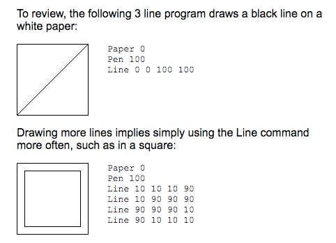
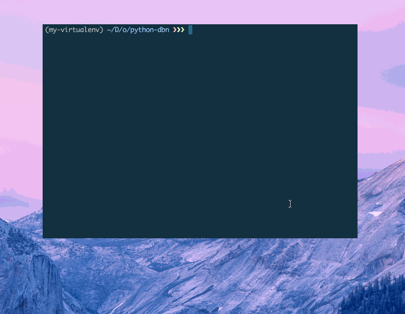

# A simple DBN compiler



From the article [How to be* a compiler — make a compiler with JavaScript](https://medium.com/@kosamari/how-to-be-a-compiler-make-a-compiler-with-javascript-4a8a13d473b4#.ibj8jb62c)

I made a simple compiler in Python to generate matplot code for rendering.

So we have from this code:

```
Paper 100
Pen 0
Line 50 77 22 27
Line 22 27 78 27
Line 78 27 50 77
```

We have this:


